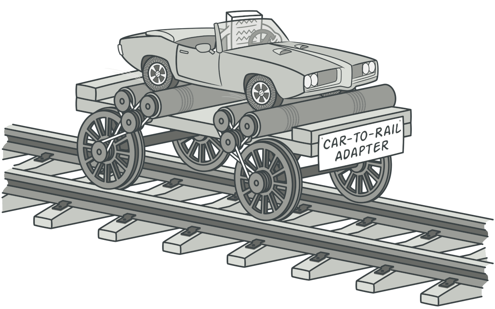

# Adapter

### Патерн проектування Adapter використовується для забезпечення взаємодії між двома незв'язаними класами або об'єктами, які інакше не можуть спілкуватися через несумісність інтерфейсів. Adapter дозволяє "адаптувати" один інтерфейс до іншого, щоб вони могли працювати разом. 

### _Додаткова інфа по цьому потерну на [GURU](https://refactoring.guru/uk/design-patterns/adapter)_

## Приклади:

#### Графічний редактор: 
Припустимо, що у вас є стороння бібліотека, яка надає функціональність для малювання геометричних фігур. Однак ця бібліотека має свій власний інтерфейс, який несумісний з вашим основним кодом редактора. Ви можете створити адаптер, який реалізовує інтерфейс вашого редактора і використовується для взаємодії з функціональністю бібліотеки.

#### Перетворення даних: 
При роботі зі сторонніми сервісами або компонентами можуть виникати ситуації, коли формат даних, який очікується, відрізняється від формату даних, який ви маєте. Використання адаптера дозволяє вам змінювати формат даних, перетворюючи їх з одного представлення в інше, щоб взаємодія була можлива.

#### Робота зі старим кодом: 
Коли ви спілкуєтеся зі старим кодом або сторонніми бібліотеками, інтерфейс яких застарілий або змінився, ви можете використовувати адаптер, щоб інтерфейс старого коду або бібліотеки виглядав так само, як і новий інтерфейс. Це дозволяє вам використовувати старий код без необхідності його повного перепису.

### Усі ці приклади показують, що патерн проектування Adapter дозволяє вирішувати проблеми несумісності інтерфейсів, забезпечуючи взаємодію між різними компонентами програми. Він дозволяє зберегти принцип єдиної відповідальності (Single Responsibility Principle) і уникнути внесення значних змін у вже наявний код.
